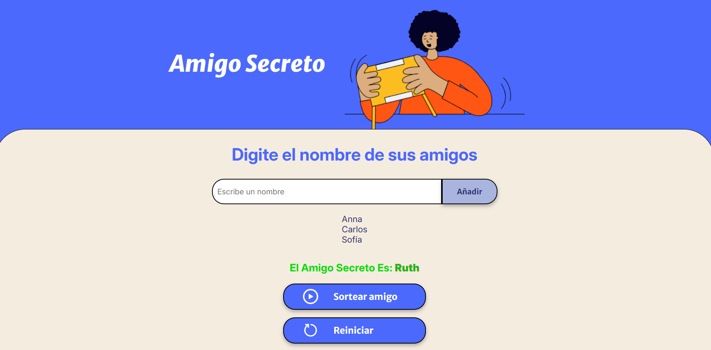

# 🎁 Amigo Secreto - La Diversión Comienza Aquí

Bienvenido a **Amigo Secreto**, una aplicación interactiva que te ayuda a organizar un sorteo rápido y divertido entre amigos. 🎉👯️

## ✨ Características Principales

- Agrega nombres de tus amigos al sorteo.
- Selecciona un amigo secreto de forma aleatoria.
- Reinicia el juego en cualquier momento.
- Interfaz atractiva y fácil de usar.

## 💻 Tecnologías Utilizadas

- HTML, CSS y JavaScript
- Diseño responsivo y atractivo

## 🚀 Cómo Usarlo

1. Escribe los nombres de los participantes y presiona **Añadir**.
2. Una vez que tengas suficientes nombres, presiona **Sortear amigo**.
3. Descubre quién es el **Amigo Secreto**.
4. Para reiniciar el sorteo, simplemente presiona **Reiniciar**.

## ✨ Captura de Pantalla

## 🎨 Personalización

¡Dale tu propio estilo! Modifica los colores, fuentes y diseño según tu gusto.

## 🔧 Contribuciones

Si deseas mejorar la aplicación, siéntete libre de hacer un **fork** y enviar un **pull request**.

---

# 🚀🚀🚀 Que empiece la diversión!

Disfruta de tu sorteo y comparte momentos inolvidables con tus amigos. 💚